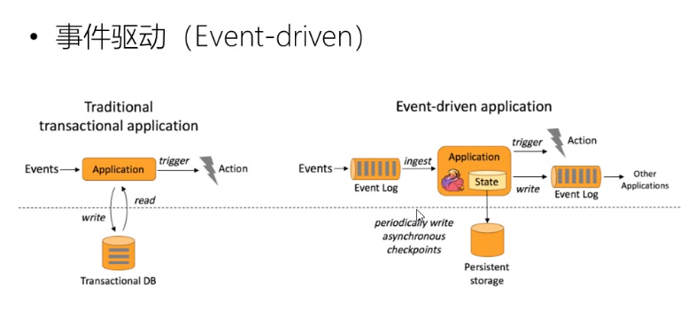
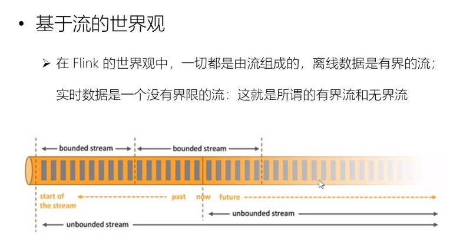
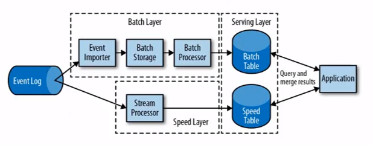
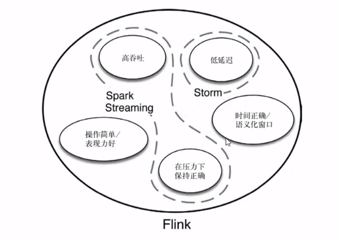
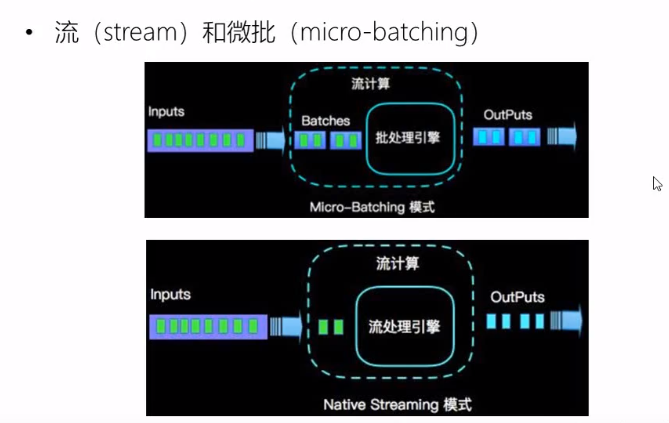
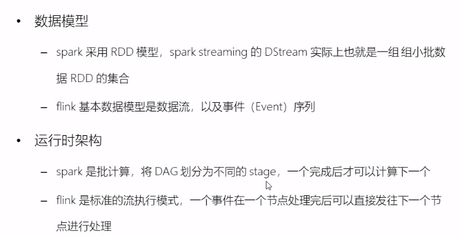

# Flink 学习与例子

## Flink是什么？为什么要用Flink?
* flink是一个框架和流势处理引擎，用于对有界和无界数据流进行状态计算
* 为什么要用Flink?
    * 我们生活中的数据是不断产生的,对应的数据处理系统当然是越快越好
    * 处理这些流数据，我们希望是 高可用，高性能，高吞吐，高可扩展，准确性，低延时
    * 部分业务场景下（如过马路）我们希望是低延时的，对比传统的数据处理引擎是微批处理显然延时较高
* flink特点
    * 事件驱动 
    * 基于流的世界观 
    * 分层API 
    
## 流处理演变
* lambda架构
    * 
    * 用两套系统同时保证系统的低延时与准确性
    * 因为维护了两套系统，所以机器成本，维护成本都很大
* flink与其他流处理系统比较
    * 
* flink与spark streaming对比
    * 流与微批 
    * 
    * 数据模型，spark是RDD模型，flink是流数据
    * 运行时架构，spark的DAG划分不同stage一个完成后才能做另外一个，flink是流模式一个事件执行完可以执行发给下一个节点处理
